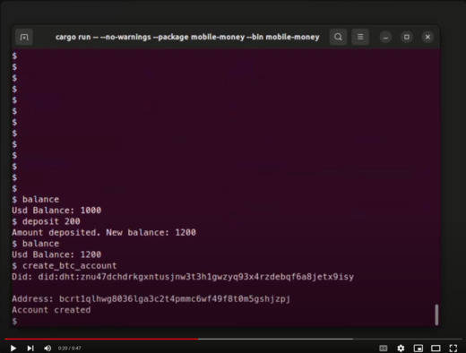

<a id="readme-top"></a>


<!-- PROJECT LOGO -->
<br />
<div align="center">
  <a href="/">
    
  </a>

  <h3 align="center">Mobile-Money (M-Money)</h3>

  <p align="center">
    A Dummy Mobile Money Cli Application exploring Bitcoin-Wasm Payment Node plugin and tbDEX Protocol
    <br />
     <br />
    This application was made in part to satisfy the tbDex African Hackathon 2024 requirements.. 
    <br />
    <a href="https://drive.google.com/file/d/1khb6cEO5vPhXf4IVqJvdeWASrQrHdYT8/view?usp=sharing">View Demo</a>
  </p>
</div>


[](https://youtu.be/M45dhTYDoVk)


<!-- ABOUT THE PROJECT -->
## About The Project

Mobile Money Applications have become widely used in our society, serving as a one-stop shop for all payment transactions; the addition of bitcoin borderless payment is only a natural progression. It is only advantageous that such addition be non-custodial in nature, preserving all of the benefits of using Bitcoin. There is also one critical element, which is the conversion of local currency to fiat and vice versa, which would be addressed by the tbDEX Protocol.  

M-Money is a demo cli mobile money application that demonstrates how to add such functionality using the self-developed [Bitcoin-wasm 'Payment Node' plugin](https://github.com/aruokhai/bitcoin-wasm), which enables the provision of non-custodial bitcoin accounts, allowing mobile money users to make cross-border payments and transfers using bitcoin as well as seamlessly convert Fiat to Bitcoin and back using the `tbDEX` protocol.

#### Features 

The cli application provides the same features as any other mobile money application, it also includes features that are only available through the Node plugin, which are:

* *Create Bitcoin Account:* Creates a new Bitcoin account for users. CLI command: `create_btc_account`
* *Get Conversion Offer:* Retrieves conversion offers for exchanging Fiat to Bitcoin or vice versa (using tbDex). CLI command: `get_conversion_offer`
* *Convert Amount:* Converts a specified amount of Fiat to Bitcoin or vice versa (using tbDex). CLI command: `convert_amount`
* *Send Bitcoin:* Allows users to send Bitcoin to other addresses. CLI command: `send_btc`

These features allow you to extend a mobile money application with a bitcoin payment solution. The following payment flows are now possible through a mobile money app:  

```mermaid
flowchart LR
    A[Deposit Fiat ] --> B(Convert Fiat to BTC) --> C(Send BTC )
    
```

```mermaid
flowchart LR
    A[Receive BTC ] --> B(Convert BTC to Fiat) --> C(Withdraw Fiat)
    
```

### Constraint

- The Application currently uses the provided PFI ( 
🏦 Vertex Liquid Assets DID: did:dht:enwguxo8uzqexq14xupe4o9ymxw3nzeb9uug5ijkj9rhfbf1oy5y ), because it is the only PFI that offers  Fiat - BTC conversion .

- The Node plugin currently connects to a `RegTest` bitcoin node and retrieves its balance through compact block filtering and tracks just a particular bitcoin address.

### tbdex Design Consideration

- __Profitability__: By itself, the Payment Node Plugin is available for use by any mobile money provider and is open source. Depending on their financial goals, these mobile money operators may charge their users a flat fee or a percentage for each currency conversion after it is carried out.

- __Optionality__: The Payment Node plugin is special because it manages the conversion of Bitcoin to Fiat and vice versa to encourage simplicity.  The Mobile Money operators will provide specific preference input to the Node for use in selecting offers. The operators' considerations will include costs and the estimated time of settlement.  The selected offer must still be displayed to to the user in order to provide the option of accepting or declining.

- __Customer Management__: Sensitive information like user Bearer DIDs and verifiable credentials would not be present in the Payment Node Plugin or the Mobile Money Application. Instead, the Bitcoin-wasm Signer Software stores all the required information and provide signing functionality using JSON as the message passing format. Note: This is a work in progress. 

- __Customer Satisfaction__: The `Payment Node` plugin will have a rating system that will record data about the dependability of Known PFIs. This data will be used as a criterion to determine which offer to present to the Mobile Money Application user.

## Run
To operate the demo, a few prerequisites must be installed, such as those for the project as a whole. For the RegTest Bitcoin node to operate, Docker needs to be installed.

Below are the necessary Details needed to run The Application 

1. Install the necessary prerequisites as required by the bitcoin-wasm project

2. Start the Bitcoin RegTest Node
   ```sh
   ./bitcoin-node.sh
   ```
3. Start The Application
   ```sh
   cargo run --package mobile-money --bin mobile-money 
   ```
4. To view commands, enter help into the CLI application.
   ```sh
   $ help
   ```


<p align="right">(<a href="#readme-top">back to top</a>)</p>


